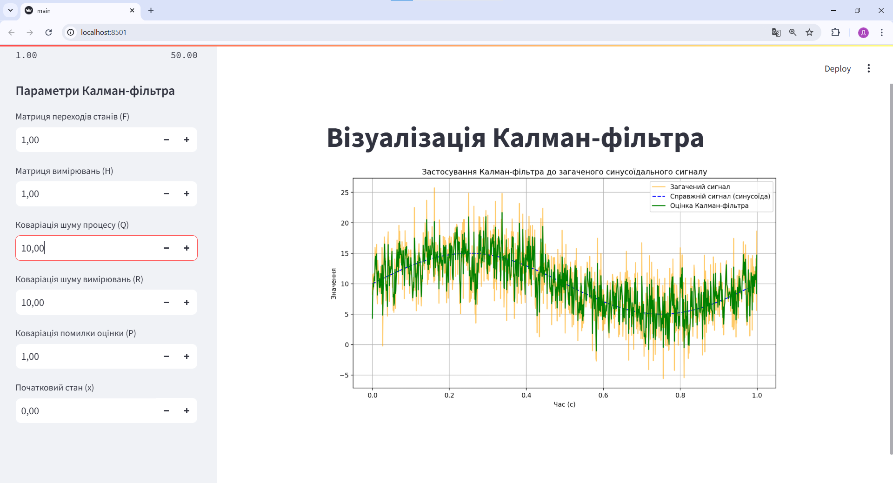
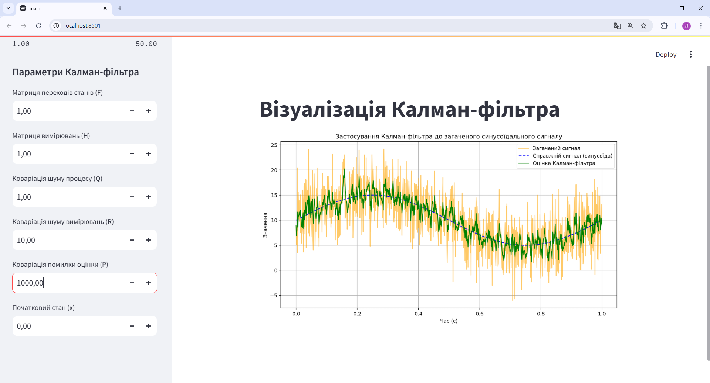

<h2>Дослідження впливу параметрів Калман-фільтра</h2>

    

    Виконання команди <code>streamlit run</code> для запуску застосунку

    

    Схема Калман-фільтра на стандартних налаштуваннях

<h3>1. Вплив Матриці коваріації шуму процесу (Q)</h3>

Параметр <strong>Q</strong> визначає рівень довіри до моделі процесу. Підвищення значення Q сприяє більшій гнучкості фільтра, що дозволяє йому швидше реагувати на зміни сигналу, але може знизити стабільність, додаючи більше "коливань" у вихідні дані.

    

    Низьке значення процесної коваріації шуму

    

    Високе значення процесної коваріації шуму

<h3>2. Вплив Матриці коваріації шуму вимірювання (R)</h3>

Параметр <strong>R</strong> показує, наскільки сильно фільтр довіряє вимірюванням. При низькому значенні R фільтр дуже чутливий до шуму, оскільки сильно покладається на отримані вимірювання. При високих значеннях фільтр ігнорує шумні дані, використовуючи більше попередні оцінки.

    

    Низьке значення коваріації шуму вимірювання

    

    Високе значення коваріації шуму вимірювання

<h3>3. Вплив Початкової матриці коваріації (P)</h3>

Значення <strong>P</strong> визначає початкову невпевненість фільтра в своїй оцінці стану. Низьке значення P означає, що фільтр довіряє початковим значенням, що може знизити адаптивність на початкових етапах. Високі значення P, навпаки, підвищують гнучкість фільтра, дозволяючи йому швидше підлаштуватися до нових даних.

    

    Низьке значення початкової матриці коваріації

    

    Високе значення початкової матриці коваріації

<h3>4. Вплив Початкової оцінки стану (Initial state estimate)</h3>

Різні початкові оцінки стану дають змогу побачити, як фільтр адаптується. Якщо початковий стан близький до істинного значення, фільтр швидко стабілізується. При значному відхиленні початкового стану фільтр потребує більше часу для збіжності.

    

    Початкова оцінка стану з близьким до реального значення

    

    Початкова оцінка стану з далеким від реального значення

<h3>5. Вплив Постійної складової сигналу (offset)</h3>

Зміна <strong>offset</strong> дозволяє оцінити, як фільтр реагує на зміщення в сигналі. Зазвичай, якщо фільтр налаштований правильно, він швидко адаптується до нового рівня сигналу, незалежно від зсуву.

    

    Високе значення зсуву сигналу

<h3>6. Вплив Загального часу моделювання (total_time)</h3>

Чим довше триває моделювання, тим більше часу у фільтра на адаптацію. Для тривалих симуляцій фільтр досягає стабільних результатів, навіть якщо налаштований на згладжування короткострокових коливань.

    

    Короткий час моделювання

    

    Довгий час моделювання

Налаштування цих параметрів дозволяє зрозуміти поведінку Калман-фільтра в різних умовах і знайти оптимальні значення для конкретного завдання.
